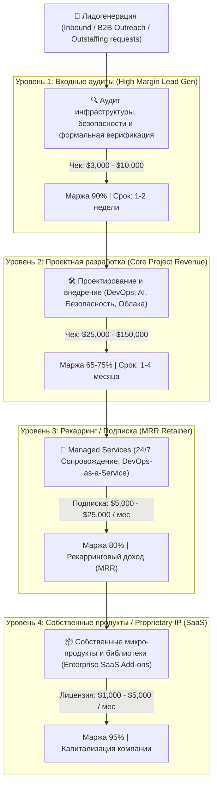
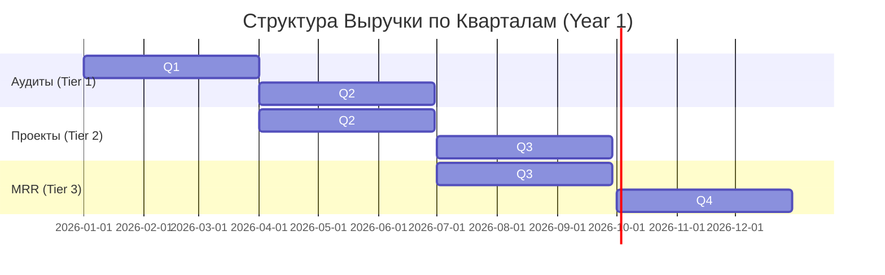

# 🚀 Бизнес-план и Архитектура ИТ-Услуг (Высокомаржинальная Гибридная Модель)

Данный бизнес-план представляет **наиболее прибыльную схему ИТ-услуг** (модель *Productized Services + High-Ticket Enterprise + MRR Retainers*), обеспечивающую **маржинальность 65–85%** и высокий показатель LTV (Lifetime Value).

---

## 📊 1. Схема Воронки и Уровней Услуг (Service Value Ladder)

---

## 💡 2. Структура Высокодоходных Направлений ИТ-Услуг

### 1. Формальная верификация и Аудит кода / Инфраструктуры
* **Описание**: Проверка критических систем (финансовые платформы, смарт-контракты, ядро ОС, параллельные системы на SPIN/Promela) на отсутствие гонок, дэдлоков и уязвимостей.
* **Почему выгодно**: Экспертная ниша с минимальной конкуренцией, стоимость ошибки для клиента — миллионы долларов.

### 2. DevOps & Cloud Architecture as a Service
* **Описание**: Построение CI/CD, K8s-кластеров, автоматизация деплоя, миграция в облака.
* **Почему выгодно**: Перевод клиентов с разового разового проекта на ежемесячный Retainer (подписку) на поддержку.

### 3. Интеграция AI-Агентов и Корпоративная Автоматизация
* **Описание**: Внедрение автономных LLM-агентов во внутренние CRM/ERP/Helpdesk системы компаний.
* **Почему выгодно**: Высокий спрос B2B-сегмента, готовый к высокому чеку за оптимизацию штата.

---

## 📈 3. Юнит-Экономика и Финансовая Модель

### Структура Расходов и Доходов на 1 B2B Клиента:

| Этап / Услуга | Средний чек ($) | Себестоимость (ФОТ/Инфраструктура) | Валовая Прибыль ($) | Маржинальность (%) |
|---|---|---|---|---|
| **ИТ-Аудит систем** | $5,000 | $750 | **$4,250** | **85%** |
| **Внедрение под ключ** | $50,000 | $15,000 | **$35,000** | **70%** |
| **Ежемесячный Retainer (MRR)** | $10,000 / мес | $2,000 / мес | **$8,000 / мес** | **80%** |

### Прогноз Доходов (P&L) при 10 ключевых клиентах в год:

* **Годовая выручка от Аудитов (20 клиентов)**: $100,000
* **Годовая выручка от Проектов (10 клиентов)**: $500,000
* **Годовая выручка от Retainer (8 клиентов x $10k/мес x 12 мес)**: $960,000
* **Итоговая выручка**: **$1,560,000 / год**
* **Чистая маржинальность компании**: **~68%** ($1,060,000 чистой прибыли)

---

## ⚡️ 4. Ключевые Факторы Успеха (КФУ)

1. **Отказ от почасовой оплаты (Time & Materials) в пользу Value-Based Pricing**:
   Клиент платит не за часы разработчика, а за экономию $500,000/год или устранение критического риска.
2. **Продуктизация Услуг (Productized Services)**:
   Каждая услуга имеет четкий фиксированный объем (Scope), фиксированный чек и автоматизированный регламент выполнения.
3. **Фокус на Retainer (MRR)**:
   Главная цель проектной команды — перевести клиента на постоянную ежемесячную техническую/безопасную подписку.
